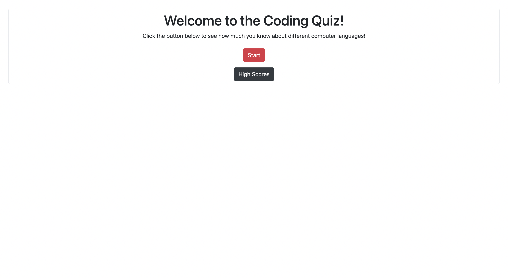

# Coding Quiz

Used Bootstrap and Jquery to build a timed coding quiz with multiple-choice questions. This app will run in the browser and features dynamically updated HTML powered by JavaScript code. It has a clean, polished, and responsive user interface that is composed of four major Bootstrap components. First you are greeted by the homescreen component where you can press start and load the second component of the game, the questions component. After the quiz is finished it is followed up by the All Done component, where your score is up for display and you can choose to submit your score to be displayed in the final component, the High Scores Chart. Finally after viewing the High Scores Chart you can choose to clear the high scores or leave them before going back to the homescreen. 

https://github.com/RosalvaMartinez/coding_quiz
https://rosalvamartinez.github.io/coding_quiz

